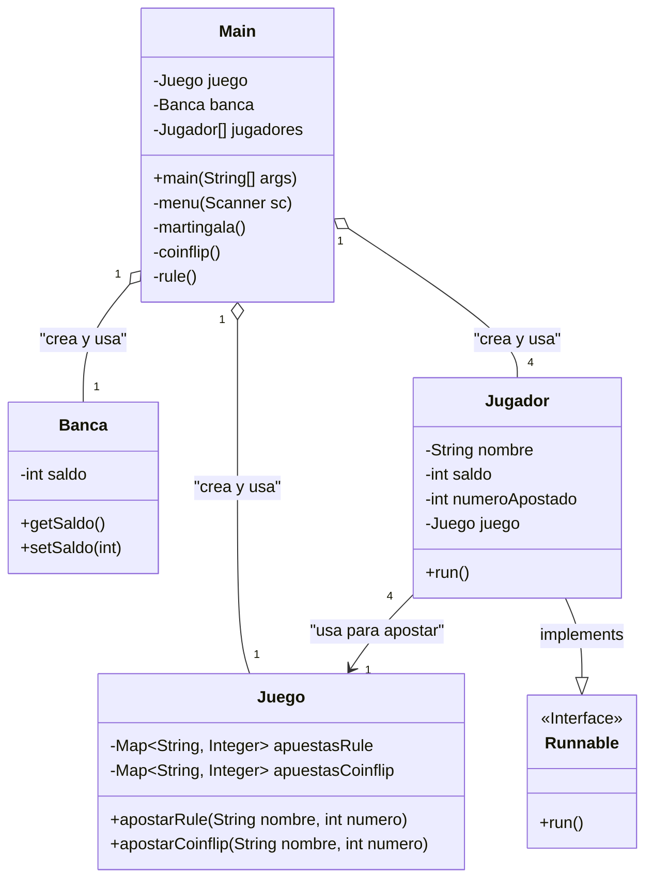

# Diagrama de Clases del Proyecto

Este documento describe las clases principales de la aplicación y sus relaciones. El diagrama está escrito en sintaxis [Mermaid](https://mermaid-js.github.io/mermaid/#/classDiagram).

## Representación Gráfica (Mermaid)

## Descripción de las Clases

### **`Main`**
- **Responsabilidad**: Es la clase principal que organiza toda la aplicación. Contiene el punto de entrada (`main`).
- **Relaciones**:
    - **Agrega** una instancia de `Banca`, una de `Juego` y un array de `Jugador`. Es responsable de crear y orquestar estos objetos.

### **`Banca`**
- **Responsabilidad**: Modela a la banca o "la casa" del casino. Su única función es gestionar su propio `saldo`.
- **Atributos**:
    - `saldo`: El dinero total que tiene la banca.
- **Relaciones**:
    - Es contenida y utilizada por `Main`.

### **`Juego`**
- **Responsabilidad**: Actúa como la mesa de juego. Su función es centralizar y registrar las apuestas de los jugadores de forma segura (usando métodos `synchronized`).
- **Atributos**:
    - `apuestasRule`, `apuestasCoinflip`: Mapas que almacenan las apuestas de los jugadores (`nombre -> número apostado`).
- **Relaciones**:
    - Es contenido por `Main` y utilizado por cada `Jugador` para registrar su apuesta.

### **`Jugador`**
- **Responsabilidad**: Modela a un participante del juego. Puede ejecutarse en su propio hilo para realizar apuestas de forma concurrente.
- **Atributos**:
    - `nombre`, `saldo`: Identificador y dinero del jugador.
    - `juego`: Referencia al objeto `Juego` compartido donde debe apostar.
- **Relaciones**:
    - **Implementa** la interfaz `Runnable`, lo que le permite ser ejecutado en un `Thread`.
    - **Usa** una instancia de `Juego` (que le fue pasada en su constructor) para poder realizar una apuesta.

### **`Runnable`** (Interfaz de Java)
- **Responsabilidad**: Es una interfaz del API de Java que define un único método, `run()`. Una clase que la implementa puede ser ejecutada por un objeto `Thread`.
